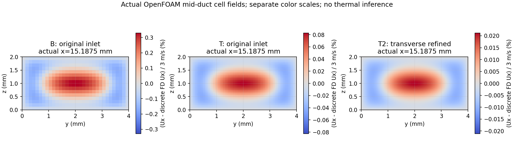

# 三维流道压力误差：定向加密诊断

## 结论

原压力网格敏感性主要来自横截面。独立改变轴向与截面后，截面占两项变化绝对值的 **98.12%**。但“充分发展截面离散误差足以解释全部偏差”的预设假说不成立：中、细截面仍分别有 **34.16% / 32.82%** 的总偏差属于入口、端部、轴向及其耦合影响。

原三网格 **1.120839% > 1%** 的压力变化门槛仍然失败。本次五个新定向网格算例通过执行检查，但第六个入口隔离对照未通过预设残差门槛，不能把这次研究称为全部通过，也不能宣称入口原因已经验证闭环。

## 实际新增结果

所有比较保持合成通道 30×4×2 mm、实际入口体积流量 2.4×10⁻⁵ m³/s（面积均速3 m/s）、同一流动离散格式及边界。只改变指定网格方向。压力用同一个 x/L=0.25–0.75 区间拟合。充分发展连续解析目标是 **236.136103 Pa/m**；它并不是当前有限流道入口边界问题的严格精确解。

| 算例 | 网格 nx×ny×nz | 压力梯度 Pa/m | 对充分发展解析目标偏差 |
|---|---:|---:|---:|
| B：原中网格 | 80×32×16 | 232.640371 | −1.480389% |
| A：只加密轴向 | 160×32×16 | 232.590013 | −1.501714% |
| T：只加密截面 | 80×64×32 | 235.270915 | −0.366394% |
| F：原全向细网格 | 160×64×32 | 235.247896 | −0.376142% |
| T2：截面再次2倍加密 | 80×128×64 | 235.926028 | −0.088963% |

- B→A 变化 −0.021646%；B→T 变化 +1.130734%
- 两方向交互项仅占原 B→F 变化的1.0484%，支持截面主导判断
- T→T2 实际测得变化 **0.278450%**，是固定轴向的截面2倍加密，不能替代原全向2倍门槛
- 截面三层差分的观察阶为1.9779和2.0055，支持近二阶趋势；Richardson外推只作条件诊断，不是GCI、物理误差条或认证依据
- T2 速度对解析点值的L2偏差0.033721%，对解析单元均值的L2偏差0.030040%，两种定义分别保存
- 全部已通过算例的最大逐截面质量通量相对偏离小于5.01×10⁻¹¹，没有把算术平均单元速度误当守恒通量

## 保留的入口对照失败

补充算例把B网格的入口改成同一离散横截面算子的充分发展速度分布，保持相同物理流量。它在1500次迭代上限结束，Uy、Uz的最后初始相对残差分别为1.587×10⁻⁷、1.781×10⁻⁷，超过固定的10⁻⁷门槛，求解器没有声明收敛。

其末次压力场只能作为明确标注的探索性诊断保存，已排除在通过算例、图表、误差阶和因果结论之外。没有增加迭代次数、放宽门槛或改写原失败。完整日志和最终原生场的哈希仍可核验。

## 仍然需要注意

- B网格不同压力拟合区间的结果跨度0.265847%，超过事先登记的0.1%报告界限；T2降至0.010740%，但这不覆盖入口全域
- T2入口附近的局部压力梯度存在网格级起伏，实际数据见对比图C；内部区间拟合良好不代表入口全域已经验证
- 入口中点归一化使每档实际流量固定，但对应连续剖面幅值略有变化；该效应单独记录，没有拿较容易接近的参考值替换固定3 m/s目标
- 同样量级的单元数不保证更低求解成本：T2为655,360单元，求解1110.84秒；本研究没有据此声称总体效率或传热精度改善
- 本轮仅求解动量，没有新热场、固体导热或共轭传热证据。原冷入口/热壁交角奇异性及“总壁面热量不可当收敛物理预测”的限制不变

## 预算与核验

计划及求解脚本在首个新算例执行前锁定哈希。五个通过的新算例实测求解时间合计1276.95秒；失败入口算例的OpenFOAM日志显示57秒，原驱动在写精确子进程计时前因未收敛而退出。预算核算保守地将该例完整1200秒额度计入，总计2476.95秒上界，仍小于2700秒预算，没有编造精确总耗时。

原包26个文件及220个原始源文件保持哈希不变；新原生网格、字典、场及日志另行登记。265项应用测试、8项原三维证据测试、12项本次专项测试通过。测试通过不等于本次所有科学验收通过。

下一步应先查清入口隔离对照的残差平台与入口局部起伏，独立登记并验证收敛处理，再考虑新的全向2倍网格研究。当前不据此进入共轭传热或真实飞机物理预测，也没有发布、合并或集成到应用。

## 附图

